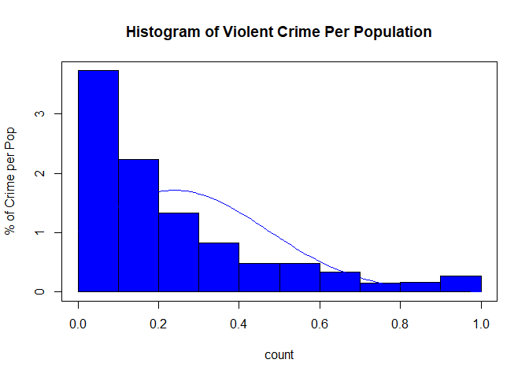

data import and tidy data

Introduction:

Comm


```r
crimedata  <- "http://archive.ics.uci.edu/ml/machine-learning-databases/communities/communities.data"
df <- read.csv(crimedata, header = FALSE)

crimedata <- df 
str(crimedata)
```

```
## 'data.frame':	1994 obs. of  128 variables:
##  $ V1  : int  8 53 24 34 42 6 44 6 21 29 ...
##  $ V2  : Factor w/ 109 levels "?","1","101",..: 1 1 1 58 107 1 79 1 1 1 ...
##  $ V3  : Factor w/ 800 levels "?","100","1000",..: 1 1 1 727 519 1 283 1 1 1 ...
##  $ V4  : Factor w/ 1828 levels "Aberdeencity",..: 796 1626 2 1788 142 1520 840 1462 669 288 ...
##  $ V5  : int  1 1 1 1 1 1 1 1 1 1 ...
##  $ V6  : num  0.19 0 0 0.04 0.01 0.02 0.01 0.01 0.03 0.01 ...
##  $ V7  : num  0.33 0.16 0.42 0.77 0.55 0.28 0.39 0.74 0.34 0.4 ...
##  $ V8  : num  0.02 0.12 0.49 1 0.02 0.06 0 0.03 0.2 0.06 ...
##  $ V9  : num  0.9 0.74 0.56 0.08 0.95 0.54 0.98 0.46 0.84 0.87 ...
##  $ V10 : num  0.12 0.45 0.17 0.12 0.09 1 0.06 0.2 0.02 0.3 ...
##  $ V11 : num  0.17 0.07 0.04 0.1 0.05 0.25 0.02 1 0 0.03 ...
##  $ V12 : num  0.34 0.26 0.39 0.51 0.38 0.31 0.3 0.52 0.38 0.9 ...
##  $ V13 : num  0.47 0.59 0.47 0.5 0.38 0.48 0.37 0.55 0.45 0.82 ...
##  $ V14 : num  0.29 0.35 0.28 0.34 0.23 0.27 0.23 0.36 0.28 0.8 ...
##  $ V15 : num  0.32 0.27 0.32 0.21 0.36 0.37 0.6 0.35 0.48 0.39 ...
##  $ V16 : num  0.2 0.02 0 0.06 0.02 0.04 0.02 0 0.04 0.02 ...
##  $ V17 : num  1 1 0 1 0.9 1 0.81 0 1 1 ...
##  $ V18 : num  0.37 0.31 0.3 0.58 0.5 0.52 0.42 0.16 0.17 0.54 ...
##  $ V19 : num  0.72 0.72 0.58 0.89 0.72 0.68 0.5 0.44 0.47 0.59 ...
##  $ V20 : num  0.34 0.11 0.19 0.21 0.16 0.2 0.23 1 0.36 0.22 ...
##  $ V21 : num  0.6 0.45 0.39 0.43 0.68 0.61 0.68 0.23 0.34 0.86 ...
##  $ V22 : num  0.29 0.25 0.38 0.36 0.44 0.28 0.61 0.53 0.55 0.42 ...
##  $ V23 : num  0.15 0.29 0.4 0.2 0.11 0.15 0.21 0.97 0.48 0.02 ...
##  $ V24 : num  0.43 0.39 0.84 0.82 0.71 0.25 0.54 0.41 0.43 0.31 ...
##  $ V25 : num  0.39 0.29 0.28 0.51 0.46 0.62 0.43 0.15 0.21 0.85 ...
##  $ V26 : num  0.4 0.37 0.27 0.36 0.43 0.72 0.47 0.1 0.23 0.89 ...
##  $ V27 : num  0.39 0.38 0.29 0.4 0.41 0.76 0.44 0.12 0.23 0.94 ...
##  $ V28 : num  0.32 0.33 0.27 0.39 0.28 0.77 0.4 0.08 0.19 0.11 ...
##  $ V29 : num  0.27 0.16 0.07 0.16 0 0.28 0.24 0.17 0.1 0.09 ...
##  $ V30 : num  0.27 0.3 0.29 0.25 0.74 0.52 0.86 0.27 0.26 0.33 ...
##  $ V31 : Factor w/ 98 levels "?","0","0.01",..: 38 24 30 38 53 50 26 20 31 19 ...
##  $ V32 : num  0.41 0.35 0.39 0.44 0.48 0.6 0.36 0.21 0.22 0.8 ...
##  $ V33 : num  0.08 0.01 0.01 0.01 0 0.01 0.01 0.03 0.04 0 ...
##  $ V34 : num  0.19 0.24 0.27 0.1 0.06 0.12 0.11 0.64 0.45 0.11 ...
##  $ V35 : num  0.1 0.14 0.27 0.09 0.25 0.13 0.29 0.96 0.52 0.04 ...
##  $ V36 : num  0.18 0.24 0.43 0.25 0.3 0.12 0.41 0.82 0.59 0.03 ...
##  $ V37 : num  0.48 0.3 0.19 0.31 0.33 0.8 0.36 0.12 0.17 1 ...
##  $ V38 : num  0.27 0.27 0.36 0.33 0.12 0.1 0.28 1 0.55 0.11 ...
##  $ V39 : num  0.68 0.73 0.58 0.71 0.65 0.65 0.54 0.26 0.43 0.44 ...
##  $ V40 : num  0.23 0.57 0.32 0.36 0.67 0.19 0.44 0.43 0.59 0.2 ...
##  $ V41 : num  0.41 0.15 0.29 0.45 0.38 0.77 0.53 0.34 0.36 1 ...
##  $ V42 : num  0.25 0.42 0.49 0.37 0.42 0.06 0.33 0.71 0.64 0.02 ...
##  $ V43 : num  0.52 0.36 0.32 0.39 0.46 0.91 0.49 0.18 0.29 0.96 ...
##  $ V44 : num  0.68 1 0.63 0.34 0.22 0.49 0.25 0.38 0.62 0.3 ...
##  $ V45 : num  0.4 0.63 0.41 0.45 0.27 0.57 0.34 0.47 0.26 0.85 ...
##  $ V46 : num  0.75 0.91 0.71 0.49 0.2 0.61 0.28 0.59 0.66 0.39 ...
##  $ V47 : num  0.75 1 0.7 0.44 0.21 0.58 0.28 0.52 0.67 0.36 ...
##  $ V48 : num  0.35 0.29 0.45 0.75 0.51 0.44 0.42 0.78 0.37 0.31 ...
##  $ V49 : num  0.55 0.43 0.42 0.65 0.91 0.62 0.77 0.45 0.51 0.65 ...
##  $ V50 : num  0.59 0.47 0.44 0.54 0.91 0.69 0.81 0.43 0.55 0.73 ...
##  $ V51 : num  0.61 0.6 0.43 0.83 0.89 0.87 0.79 0.34 0.58 0.78 ...
##  $ V52 : num  0.56 0.39 0.43 0.65 0.85 0.53 0.74 0.34 0.47 0.67 ...
##  $ V53 : num  0.74 0.46 0.71 0.85 0.4 0.3 0.57 0.29 0.65 0.72 ...
##  $ V54 : num  0.76 0.53 0.67 0.86 0.6 0.43 0.62 0.27 0.64 0.71 ...
##  $ V55 : num  0.04 0 0.01 0.03 0 0 0 0.02 0.02 0 ...
##  $ V56 : num  0.14 0.24 0.46 0.33 0.06 0.11 0.13 0.5 0.29 0.07 ...
##  $ V57 : num  0.03 0.01 0 0.02 0 0.04 0.01 0.02 0 0.01 ...
##  $ V58 : num  0.24 0.52 0.07 0.11 0.03 0.3 0 0.5 0.12 0.41 ...
##  $ V59 : num  0.27 0.62 0.06 0.2 0.07 0.35 0.02 0.59 0.09 0.44 ...
##  $ V60 : num  0.37 0.64 0.15 0.3 0.2 0.43 0.02 0.65 0.07 0.52 ...
##  $ V61 : num  0.39 0.63 0.19 0.31 0.27 0.47 0.1 0.59 0.13 0.48 ...
##  $ V62 : num  0.07 0.25 0.02 0.05 0.01 0.5 0 0.69 0 0.22 ...
##  $ V63 : num  0.07 0.27 0.02 0.08 0.02 0.5 0.01 0.72 0 0.21 ...
##  $ V64 : num  0.08 0.25 0.04 0.11 0.04 0.56 0.01 0.71 0 0.22 ...
##  $ V65 : num  0.08 0.23 0.05 0.11 0.05 0.57 0.03 0.6 0 0.19 ...
##  $ V66 : num  0.89 0.84 0.88 0.81 0.88 0.45 0.73 0.12 0.99 0.85 ...
##  $ V67 : num  0.06 0.1 0.04 0.08 0.05 0.28 0.05 0.93 0.01 0.03 ...
##  $ V68 : num  0.14 0.16 0.2 0.56 0.16 0.25 0.12 0.74 0.12 0.09 ...
##  $ V69 : num  0.13 0.1 0.2 0.62 0.19 0.19 0.13 0.75 0.12 0.06 ...
##  $ V70 : num  0.33 0.17 0.46 0.85 0.59 0.29 0.42 0.8 0.35 0.15 ...
##  $ V71 : num  0.39 0.29 0.52 0.77 0.6 0.53 0.54 0.68 0.38 0.34 ...
##  $ V72 : num  0.28 0.17 0.43 1 0.37 0.18 0.24 0.92 0.33 0.05 ...
##  $ V73 : num  0.55 0.26 0.42 0.94 0.89 0.39 0.65 0.39 0.5 0.48 ...
##  $ V74 : num  0.09 0.2 0.15 0.12 0.02 0.26 0.03 0.89 0.1 0.03 ...
##  $ V75 : num  0.51 0.82 0.51 0.01 0.19 0.73 0.46 0.66 0.64 0.58 ...
##  $ V76 : num  0.5 0 0.5 0.5 0.5 0 0.5 0 0 0 ...
##  $ V77 : num  0.21 0.02 0.01 0.01 0.01 0.02 0.01 0.01 0.04 0.02 ...
##  $ V78 : num  0.71 0.79 0.86 0.97 0.89 0.84 0.89 0.91 0.72 0.72 ...
##  $ V79 : num  0.52 0.24 0.41 0.96 0.87 0.3 0.57 0.46 0.49 0.38 ...
##  $ V80 : num  0.05 0.02 0.29 0.6 0.04 0.16 0.09 0.22 0.05 0.07 ...
##  $ V81 : num  0.26 0.25 0.3 0.47 0.55 0.28 0.49 0.37 0.49 0.47 ...
##  $ V82 : num  0.65 0.65 0.52 0.52 0.73 0.25 0.38 0.6 0.5 0.04 ...
##  $ V83 : num  0.14 0.16 0.47 0.11 0.05 0.02 0.05 0.28 0.57 0.01 ...
##  $ V84 : num  0.06 0 0.45 0.11 0.14 0.05 0.05 0.23 0.22 0 ...
##  $ V85 : num  0.22 0.21 0.18 0.24 0.31 0.94 0.37 0.15 0.07 0.63 ...
##  $ V86 : num  0.19 0.2 0.17 0.21 0.31 1 0.38 0.13 0.07 0.71 ...
##  $ V87 : num  0.18 0.21 0.16 0.19 0.3 1 0.39 0.13 0.08 0.79 ...
##  $ V88 : num  0.36 0.42 0.27 0.75 0.4 0.67 0.26 0.21 0.14 0.44 ...
##  $ V89 : num  0.35 0.38 0.29 0.7 0.36 0.63 0.35 0.24 0.17 0.42 ...
##  $ V90 : num  0.38 0.4 0.27 0.77 0.38 0.68 0.42 0.25 0.16 0.47 ...
##  $ V91 : num  0.34 0.37 0.31 0.89 0.38 0.62 0.35 0.24 0.15 0.41 ...
##  $ V92 : num  0.38 0.29 0.48 0.63 0.22 0.47 0.46 0.64 0.38 0.23 ...
##  $ V93 : num  0.46 0.32 0.39 0.51 0.51 0.59 0.44 0.59 0.13 0.27 ...
##  $ V94 : num  0.25 0.18 0.28 0.47 0.21 0.11 0.31 0.28 0.36 0.28 ...
##  $ V95 : num  0.04 0 0 0 0 0 0 0 0.01 0 ...
##  $ V96 : num  0 0 0 0 0 0 0 0 0 0 ...
##  $ V97 : num  0.12 0.21 0.14 0.19 0.11 0.7 0.15 0.59 0.01 0.22 ...
##  $ V98 : num  0.42 0.5 0.49 0.3 0.72 0.42 0.81 0.58 0.78 0.42 ...
##  $ V99 : num  0.5 0.34 0.54 0.73 0.64 0.49 0.77 0.52 0.48 0.34 ...
##   [list output truncated]
```

```r
colnames(crimedata) <- c("state",
"county",
"community",
"communityname ",
"fold",
"population",
"householdsize",
"racepctblack",
"racePctWhite",
"racePctAsian",
"racePctHisp",
"agePct12t21",
"agePct12t29",
"agePct16t24",
"agePct65up",
"numbUrban",
"pctUrban",
"medIncome",
"pctWWage",
"pctWFarmSelf",
"pctWInvInc",
"pctWSocSec",
"pctWPubAsst",
"pctWRetire",
"medFamInc",
"perCapInc",
"whitePerCap",
"blackPerCap",
"indianPerCap",
"AsianPerCap",
"OtherPerCap",
"HispPerCap",
"NumUnderPov",
"PctPopUnderPov",
"PctLess9thGrade",
"PctNotHSGrad",
"PctBSorMore",
"PctUnemployed",
"PctEmploy",
"PctEmplManu",
"PctEmplProfServ",
"PctOccupManu",
"PctOccupMgmtProf",
"MalePctDivorce",
"MalePctNevMarr",
"FemalePctDiv",
"TotalPctDiv",
"PersPerFam",
"PctFam2Par",
"PctKids2Par",
"PctYoungKids2Par",
"PctTeen2Par",
"PctWorkMomYoungKids",
"PctWorkMom",
"NumIlleg",
"PctIlleg",
"NumImmig",
"PctImmigRecent",
"PctImmigRec5",
"PctImmigRec8",
"PctImmigRec10",
"PctRecentImmig",
"PctRecImmig5",
"PctRecImmig8",
"PctRecImmig10",
"PctSpeakEnglOnly",
"PctNotSpeakEnglWell",
"PctLargHouseFam",
"PctLargHouseOccup",
"PersPerOccupHous",
"PersPerOwnOccHous",
"PersPerRentOccHous",
"PctPersOwnOccup",
"PctPersDenseHous",
"PctHousLess3BR",
"MedNumBR",
"HousVacant",
"PctHousOccup",
"PctHousOwnOcc",
"PctVacantBoarded",
"PctVacMore6Mos",
"MedYrHousBuilt",
"PctHousNoPhone",
"PctWOFullPlumb",
"OwnOccLowQuart",
"OwnOccMedVal",
"OwnOccHiQuart",
"RentLowQ",
"RentMedian",
"RentHighQ",
"MedRent",
"MedRentPctHousInc",
"MedOwnCostPctInc",
"MedOwnCostPctIncNoMtg",
"NumInShelters",
"NumStreet",
"PctForeignBorn",
"PctBornSameState",
"PctSameHouse85",
"PctSameCity85",
"PctSameState85",
"LemasSwornFT",
"LemasSwFTPerPop",
"LemasSwFTFieldOps",
"LemasSwFTFieldPerPop",
"LemasTotalReq",
"LemasTotReqPerPop",
"PolicReqPerOffic",
"PolicPerPop",
"RacialMatchCommPol",
"PctPolicWhite",
"PctPolicBlack",
"PctPolicHisp",
"PctPolicAsian",
"PctPolicMinor",
"OfficAssgnDrugUnits",
"NumKindsDrugsSeiz",
"PolicAveOTWorked",
"LandArea",
"PopDens",
"PctUsePubTrans",
"PolicCars",
"PolicOperBudg",
"LemasPctPolicOnPatr",
"LemasGangUnitDeploy",
"LemasPctOfficDrugUn",
"PolicBudgPerPop",
"ViolentCrimesPerPop"
)

head(crimedata)
```

```
##   state county community      communityname  fold population householdsize
## 1     8      ?         ?        Lakewoodcity    1       0.19          0.33
## 2    53      ?         ?         Tukwilacity    1       0.00          0.16
## 3    24      ?         ?        Aberdeentown    1       0.00          0.42
## 4    34      5     81440 Willingborotownship    1       0.04          0.77
## 5    42     95      6096   Bethlehemtownship    1       0.01          0.55
## 6     6      ?         ?   SouthPasadenacity    1       0.02          0.28
##   racepctblack racePctWhite racePctAsian racePctHisp agePct12t21
## 1         0.02         0.90         0.12        0.17        0.34
## 2         0.12         0.74         0.45        0.07        0.26
## 3         0.49         0.56         0.17        0.04        0.39
## 4         1.00         0.08         0.12        0.10        0.51
## 5         0.02         0.95         0.09        0.05        0.38
## 6         0.06         0.54         1.00        0.25        0.31
##   agePct12t29 agePct16t24 agePct65up numbUrban pctUrban medIncome pctWWage
## 1        0.47        0.29       0.32      0.20      1.0      0.37     0.72
## 2        0.59        0.35       0.27      0.02      1.0      0.31     0.72
## 3        0.47        0.28       0.32      0.00      0.0      0.30     0.58
## 4        0.50        0.34       0.21      0.06      1.0      0.58     0.89
## 5        0.38        0.23       0.36      0.02      0.9      0.50     0.72
## 6        0.48        0.27       0.37      0.04      1.0      0.52     0.68
##   pctWFarmSelf pctWInvInc pctWSocSec pctWPubAsst pctWRetire medFamInc
## 1         0.34       0.60       0.29        0.15       0.43      0.39
## 2         0.11       0.45       0.25        0.29       0.39      0.29
## 3         0.19       0.39       0.38        0.40       0.84      0.28
## 4         0.21       0.43       0.36        0.20       0.82      0.51
## 5         0.16       0.68       0.44        0.11       0.71      0.46
## 6         0.20       0.61       0.28        0.15       0.25      0.62
##   perCapInc whitePerCap blackPerCap indianPerCap AsianPerCap OtherPerCap
## 1      0.40        0.39        0.32         0.27        0.27        0.36
## 2      0.37        0.38        0.33         0.16        0.30        0.22
## 3      0.27        0.29        0.27         0.07        0.29        0.28
## 4      0.36        0.40        0.39         0.16        0.25        0.36
## 5      0.43        0.41        0.28         0.00        0.74        0.51
## 6      0.72        0.76        0.77         0.28        0.52        0.48
##   HispPerCap NumUnderPov PctPopUnderPov PctLess9thGrade PctNotHSGrad
## 1       0.41        0.08           0.19            0.10         0.18
## 2       0.35        0.01           0.24            0.14         0.24
## 3       0.39        0.01           0.27            0.27         0.43
## 4       0.44        0.01           0.10            0.09         0.25
## 5       0.48        0.00           0.06            0.25         0.30
## 6       0.60        0.01           0.12            0.13         0.12
##   PctBSorMore PctUnemployed PctEmploy PctEmplManu PctEmplProfServ
## 1        0.48          0.27      0.68        0.23            0.41
## 2        0.30          0.27      0.73        0.57            0.15
## 3        0.19          0.36      0.58        0.32            0.29
## 4        0.31          0.33      0.71        0.36            0.45
## 5        0.33          0.12      0.65        0.67            0.38
## 6        0.80          0.10      0.65        0.19            0.77
##   PctOccupManu PctOccupMgmtProf MalePctDivorce MalePctNevMarr FemalePctDiv
## 1         0.25             0.52           0.68           0.40         0.75
## 2         0.42             0.36           1.00           0.63         0.91
## 3         0.49             0.32           0.63           0.41         0.71
## 4         0.37             0.39           0.34           0.45         0.49
## 5         0.42             0.46           0.22           0.27         0.20
## 6         0.06             0.91           0.49           0.57         0.61
##   TotalPctDiv PersPerFam PctFam2Par PctKids2Par PctYoungKids2Par
## 1        0.75       0.35       0.55        0.59             0.61
## 2        1.00       0.29       0.43        0.47             0.60
## 3        0.70       0.45       0.42        0.44             0.43
## 4        0.44       0.75       0.65        0.54             0.83
## 5        0.21       0.51       0.91        0.91             0.89
## 6        0.58       0.44       0.62        0.69             0.87
##   PctTeen2Par PctWorkMomYoungKids PctWorkMom NumIlleg PctIlleg NumImmig
## 1        0.56                0.74       0.76     0.04     0.14     0.03
## 2        0.39                0.46       0.53     0.00     0.24     0.01
## 3        0.43                0.71       0.67     0.01     0.46     0.00
## 4        0.65                0.85       0.86     0.03     0.33     0.02
## 5        0.85                0.40       0.60     0.00     0.06     0.00
## 6        0.53                0.30       0.43     0.00     0.11     0.04
##   PctImmigRecent PctImmigRec5 PctImmigRec8 PctImmigRec10 PctRecentImmig
## 1           0.24         0.27         0.37          0.39           0.07
## 2           0.52         0.62         0.64          0.63           0.25
## 3           0.07         0.06         0.15          0.19           0.02
## 4           0.11         0.20         0.30          0.31           0.05
## 5           0.03         0.07         0.20          0.27           0.01
## 6           0.30         0.35         0.43          0.47           0.50
##   PctRecImmig5 PctRecImmig8 PctRecImmig10 PctSpeakEnglOnly
## 1         0.07         0.08          0.08             0.89
## 2         0.27         0.25          0.23             0.84
## 3         0.02         0.04          0.05             0.88
## 4         0.08         0.11          0.11             0.81
## 5         0.02         0.04          0.05             0.88
## 6         0.50         0.56          0.57             0.45
##   PctNotSpeakEnglWell PctLargHouseFam PctLargHouseOccup PersPerOccupHous
## 1                0.06            0.14              0.13             0.33
## 2                0.10            0.16              0.10             0.17
## 3                0.04            0.20              0.20             0.46
## 4                0.08            0.56              0.62             0.85
## 5                0.05            0.16              0.19             0.59
## 6                0.28            0.25              0.19             0.29
##   PersPerOwnOccHous PersPerRentOccHous PctPersOwnOccup PctPersDenseHous
## 1              0.39               0.28            0.55             0.09
## 2              0.29               0.17            0.26             0.20
## 3              0.52               0.43            0.42             0.15
## 4              0.77               1.00            0.94             0.12
## 5              0.60               0.37            0.89             0.02
## 6              0.53               0.18            0.39             0.26
##   PctHousLess3BR MedNumBR HousVacant PctHousOccup PctHousOwnOcc
## 1           0.51      0.5       0.21         0.71          0.52
## 2           0.82      0.0       0.02         0.79          0.24
## 3           0.51      0.5       0.01         0.86          0.41
## 4           0.01      0.5       0.01         0.97          0.96
## 5           0.19      0.5       0.01         0.89          0.87
## 6           0.73      0.0       0.02         0.84          0.30
##   PctVacantBoarded PctVacMore6Mos MedYrHousBuilt PctHousNoPhone
## 1             0.05           0.26           0.65           0.14
## 2             0.02           0.25           0.65           0.16
## 3             0.29           0.30           0.52           0.47
## 4             0.60           0.47           0.52           0.11
## 5             0.04           0.55           0.73           0.05
## 6             0.16           0.28           0.25           0.02
##   PctWOFullPlumb OwnOccLowQuart OwnOccMedVal OwnOccHiQuart RentLowQ
## 1           0.06           0.22         0.19          0.18     0.36
## 2           0.00           0.21         0.20          0.21     0.42
## 3           0.45           0.18         0.17          0.16     0.27
## 4           0.11           0.24         0.21          0.19     0.75
## 5           0.14           0.31         0.31          0.30     0.40
## 6           0.05           0.94         1.00          1.00     0.67
##   RentMedian RentHighQ MedRent MedRentPctHousInc MedOwnCostPctInc
## 1       0.35      0.38    0.34              0.38             0.46
## 2       0.38      0.40    0.37              0.29             0.32
## 3       0.29      0.27    0.31              0.48             0.39
## 4       0.70      0.77    0.89              0.63             0.51
## 5       0.36      0.38    0.38              0.22             0.51
## 6       0.63      0.68    0.62              0.47             0.59
##   MedOwnCostPctIncNoMtg NumInShelters NumStreet PctForeignBorn
## 1                  0.25          0.04         0           0.12
## 2                  0.18          0.00         0           0.21
## 3                  0.28          0.00         0           0.14
## 4                  0.47          0.00         0           0.19
## 5                  0.21          0.00         0           0.11
## 6                  0.11          0.00         0           0.70
##   PctBornSameState PctSameHouse85 PctSameCity85 PctSameState85
## 1             0.42           0.50          0.51           0.64
## 2             0.50           0.34          0.60           0.52
## 3             0.49           0.54          0.67           0.56
## 4             0.30           0.73          0.64           0.65
## 5             0.72           0.64          0.61           0.53
## 6             0.42           0.49          0.73           0.64
##   LemasSwornFT LemasSwFTPerPop LemasSwFTFieldOps LemasSwFTFieldPerPop
## 1         0.03            0.13              0.96                 0.17
## 2            ?               ?                 ?                    ?
## 3            ?               ?                 ?                    ?
## 4            ?               ?                 ?                    ?
## 5            ?               ?                 ?                    ?
## 6            ?               ?                 ?                    ?
##   LemasTotalReq LemasTotReqPerPop PolicReqPerOffic PolicPerPop
## 1          0.06              0.18             0.44        0.13
## 2             ?                 ?                ?           ?
## 3             ?                 ?                ?           ?
## 4             ?                 ?                ?           ?
## 5             ?                 ?                ?           ?
## 6             ?                 ?                ?           ?
##   RacialMatchCommPol PctPolicWhite PctPolicBlack PctPolicHisp
## 1               0.94          0.93          0.03         0.07
## 2                  ?             ?             ?            ?
## 3                  ?             ?             ?            ?
## 4                  ?             ?             ?            ?
## 5                  ?             ?             ?            ?
## 6                  ?             ?             ?            ?
##   PctPolicAsian PctPolicMinor OfficAssgnDrugUnits NumKindsDrugsSeiz
## 1           0.1          0.07                0.02              0.57
## 2             ?             ?                   ?                 ?
## 3             ?             ?                   ?                 ?
## 4             ?             ?                   ?                 ?
## 5             ?             ?                   ?                 ?
## 6             ?             ?                   ?                 ?
##   PolicAveOTWorked LandArea PopDens PctUsePubTrans PolicCars PolicOperBudg
## 1             0.29     0.12    0.26           0.20      0.06          0.04
## 2                ?     0.02    0.12           0.45         ?             ?
## 3                ?     0.01    0.21           0.02         ?             ?
## 4                ?     0.02    0.39           0.28         ?             ?
## 5                ?     0.04    0.09           0.02         ?             ?
## 6                ?     0.01    0.58           0.10         ?             ?
##   LemasPctPolicOnPatr LemasGangUnitDeploy LemasPctOfficDrugUn
## 1                 0.9                 0.5                0.32
## 2                   ?                   ?                0.00
## 3                   ?                   ?                0.00
## 4                   ?                   ?                0.00
## 5                   ?                   ?                0.00
## 6                   ?                   ?                0.00
##   PolicBudgPerPop ViolentCrimesPerPop
## 1            0.14                0.20
## 2               ?                0.67
## 3               ?                0.43
## 4               ?                0.12
## 5               ?                0.03
## 6               ?                0.14
```

## Data Set Citations
U. S. Department of Commerce, Bureau of the Census, Census Of Population And Housing 
1990 United States: Summary Tape File 1a & 3a (Computer Files),

U.S. Department Of Commerce, Bureau Of The Census Producer, Washington, DC and 
Inter-university Consortium for Political and Social Research Ann Arbor, Michigan. 
(1992)

U.S. Department of Justice, Bureau of Justice Statistics, Law Enforcement Management 
And Administrative Statistics (Computer File) U.S. Department Of Commerce, Bureau Of 
The Census Producer, Washington, DC and Inter-university Consortium for Political and 
Social Research Ann Arbor, Michigan. (1992)

U.S. Department of Justice, Federal Bureau of Investigation, Crime in the United 
States (Computer File) (1995)

Redmond, M. A. and A. Baveja: A Data-Driven Software Tool for Enabling Cooperative 
Information Sharing Among Police Departments. European Journal of Operational Research 
141 (2002) 660-678. 

## Introduction


```r
library(ggplot2)
```

```
## Warning: package 'ggplot2' was built under R version 3.5.1
```

```r
##Crime Data HH Size, Violent Crimes per Population, by population, State, MedIncome, Age
 
crimedata.lm <- lm(ViolentCrimesPerPop ~ medIncome, data = crimedata)
newx <- crimedata$medIncome
newx <- sort(newx)

prd_c <- predict(crimedata.lm, newdata = data.frame(medIncome = newx), 
                 interval = c("confidence"), type = c("response"), level = .99) 
prd_p <- predict(crimedata.lm, newdata = data.frame(medIncome = newx), 
                 interval = c("predict"), type = c("response"), level = .99)
```


```r
plot(crimedata$medIncome, crimedata$violentCrimesPerPop, ylab = "Crimes per Population", xlab = "Median Income")
abline(crimedata.lm, col = "red")


lines(newx,prd_c[,2],col = "blue",lty = 2, lwd = 2)
lines(newx,prd_c[,3],col = "blue", lty = 2, lwd = 2)
lines(newx,prd_p[,2],col = "green", lty = 2, lwd = 2)
lines(newx,prd_p[,3],col = "green", lty = 2, lwd = 2)
```

<!-- -->


```r
data = crimedata
cdss <- data.frame(crimedata$ViolentCrimesPerPop, crimedata$medIncome, crimedata$agePct12t29, crimedata$blackPerCap,crimedata$HispPerCap, crimedata$RentLowQ, crimedata$PctLess9thGrade)

head(cdss)
```

```
##   crimedata.ViolentCrimesPerPop crimedata.medIncome crimedata.agePct12t29
## 1                          0.20                0.37                  0.47
## 2                          0.67                0.31                  0.59
## 3                          0.43                0.30                  0.47
## 4                          0.12                0.58                  0.50
## 5                          0.03                0.50                  0.38
## 6                          0.14                0.52                  0.48
##   crimedata.blackPerCap crimedata.HispPerCap crimedata.RentLowQ
## 1                  0.32                 0.41               0.36
## 2                  0.33                 0.35               0.42
## 3                  0.27                 0.39               0.27
## 4                  0.39                 0.44               0.75
## 5                  0.28                 0.48               0.40
## 6                  0.77                 0.60               0.67
##   crimedata.PctLess9thGrade
## 1                      0.10
## 2                      0.14
## 3                      0.27
## 4                      0.09
## 5                      0.25
## 6                      0.13
```

```r
str(cdss)
```

```
## 'data.frame':	1994 obs. of  7 variables:
##  $ crimedata.ViolentCrimesPerPop: num  0.2 0.67 0.43 0.12 0.03 0.14 0.03 0.55 0.53 0.15 ...
##  $ crimedata.medIncome          : num  0.37 0.31 0.3 0.58 0.5 0.52 0.42 0.16 0.17 0.54 ...
##  $ crimedata.agePct12t29        : num  0.47 0.59 0.47 0.5 0.38 0.48 0.37 0.55 0.45 0.82 ...
##  $ crimedata.blackPerCap        : num  0.32 0.33 0.27 0.39 0.28 0.77 0.4 0.08 0.19 0.11 ...
##  $ crimedata.HispPerCap         : num  0.41 0.35 0.39 0.44 0.48 0.6 0.36 0.21 0.22 0.8 ...
##  $ crimedata.RentLowQ           : num  0.36 0.42 0.27 0.75 0.4 0.67 0.26 0.21 0.14 0.44 ...
##  $ crimedata.PctLess9thGrade    : num  0.1 0.14 0.27 0.09 0.25 0.13 0.29 0.96 0.52 0.04 ...
```

```r
summary(cdss$crimedata.ViolentCrimesPerPop)
```

```
##    Min. 1st Qu.  Median    Mean 3rd Qu.    Max. 
##   0.000   0.070   0.150   0.238   0.330   1.000
```

```r
nacdss <- is.na(cdss)
```


```r
#NABEER == NA
#sum(NABEER, count = TRUE)
#ct_SUM <- colSums(nacdss)
#ct_SUM


# Untransformed correlation test
cor(cdss$crimedata.medIncome, cdss$crimedata.ViolentCrimesPerPop)
```

```
## [1] -0.4242206
```

```r
cor(cdss$crimedata.agePct12t29, cdss$crimedata.ViolentCrimesPerPop)
```

```
## [1] 0.1533567
```

```r
cor(cdss$crimedata.blackPerCap, cdss$crimedata.ViolentCrimesPerPop)
```

```
## [1] -0.2753911
```

```r
cor(cdss$crimedata.HispPerCap, cdss$crimedata.ViolentCrimesPerPop)
```

```
## [1] -0.2445529
```

```r
cor(cdss$crimedata.RentLowQ, cdss$crimedata.ViolentCrimesPerPop)
```

```
## [1] -0.2518469
```

```r
cor(cdss$crimedata.PctLess9thGrade, cdss$crimedata.ViolentCrimesPerPop)
```

```
## [1] 0.4110955
```

```r
# Pearson's correlation test
cor.test(cdss$crimedata.medIncome, cdss$crimedata.ViolentCrimesPerPop, method = "pearson", alternative = "two.sided")
```

```
## 
## 	Pearson's product-moment correlation
## 
## data:  cdss$crimedata.medIncome and cdss$crimedata.ViolentCrimesPerPop
## t = -20.908, df = 1992, p-value < 2.2e-16
## alternative hypothesis: true correlation is not equal to 0
## 95 percent confidence interval:
##  -0.4595596 -0.3875405
## sample estimates:
##        cor 
## -0.4242206
```

```r
cor.test(cdss$crimedata.agePct12t29, cdss$crimedata.ViolentCrimesPerPop, method = "pearson", alternative = "two.sided")
```

```
## 
## 	Pearson's product-moment correlation
## 
## data:  cdss$crimedata.agePct12t29 and cdss$crimedata.ViolentCrimesPerPop
## t = 6.9265, df = 1992, p-value = 5.799e-12
## alternative hypothesis: true correlation is not equal to 0
## 95 percent confidence interval:
##  0.1102017 0.1959345
## sample estimates:
##       cor 
## 0.1533567
```

```r
cor.test(cdss$crimedata.blackPerCap, cdss$crimedata.ViolentCrimesPerPop, method = "pearson", alternative = "two.sided")
```

```
## 
## 	Pearson's product-moment correlation
## 
## data:  cdss$crimedata.blackPerCap and cdss$crimedata.ViolentCrimesPerPop
## t = -12.786, df = 1992, p-value < 2.2e-16
## alternative hypothesis: true correlation is not equal to 0
## 95 percent confidence interval:
##  -0.3154742 -0.2343270
## sample estimates:
##        cor 
## -0.2753911
```

```r
cor.test(cdss$crimedata.HispPerCap, cdss$crimedata.ViolentCrimesPerPop, method = "pearson", alternative = "two.sided")
```

```
## 
## 	Pearson's product-moment correlation
## 
## data:  cdss$crimedata.HispPerCap and cdss$crimedata.ViolentCrimesPerPop
## t = -11.257, df = 1992, p-value < 2.2e-16
## alternative hypothesis: true correlation is not equal to 0
## 95 percent confidence interval:
##  -0.2853861 -0.2028335
## sample estimates:
##        cor 
## -0.2445529
```

```r
cor.test(cdss$crimedata.RentLowQ, cdss$crimedata.ViolentCrimesPerPop, method = "pearson", alternative = "two.sided")
```

```
## 
## 	Pearson's product-moment correlation
## 
## data:  cdss$crimedata.RentLowQ and cdss$crimedata.ViolentCrimesPerPop
## t = -11.615, df = 1992, p-value < 2.2e-16
## alternative hypothesis: true correlation is not equal to 0
## 95 percent confidence interval:
##  -0.2925100 -0.2102747
## sample estimates:
##        cor 
## -0.2518469
```

```r
cor.test(cdss$crimedata.PctLess9thGrade, cdss$crimedata.ViolentCrimesPerPop, method = "pearson", alternative = "two.sided")
```

```
## 
## 	Pearson's product-moment correlation
## 
## data:  cdss$crimedata.PctLess9thGrade and cdss$crimedata.ViolentCrimesPerPop
## t = 20.127, df = 1992, p-value < 2.2e-16
## alternative hypothesis: true correlation is not equal to 0
## 95 percent confidence interval:
##  0.3739468 0.4469272
## sample estimates:
##       cor 
## 0.4110955
```

```r
#Check for normality
qqnorm(cdss$crimedata.ViolentCrimesPerPop, pch = 1, frame = FALSE, main= "Violent Crime Per Pop Data") ## plots the data
qqline(cdss$crimedata.ViolentCrimesPerPop, col = "steelblue", lwd = 2) ## adds a line
```

<!-- -->

```r
qqnorm(cdss$crimedata.medIncome, pch = 1, frame = FALSE, main= "Median Income Data") ## plots the data
qqline(cdss$crimedata.medIncome, col = "steelblue", lwd = 2) ## adds a line
```

<!-- -->

```r
qqnorm(cdss$crimedata.agePct12t29, pch = 1, frame = FALSE, main= "Age % 12 - 29 yrs old Data") ## plots the data
qqline(cdss$crimedata.agePct12t29, col = "steelblue", lwd = 2) ## adds a line
```

<!-- -->

```r
qqnorm(cdss$crimedata.blackPerCap, pch = 1, frame = FALSE, main= "Black Per Capita data") ## plots the data
qqline(cdss$crimedata.blackPerCap, col = "steelblue", lwd = 2) ## adds a line
```

<!-- -->

```r
qqnorm(cdss$crimedata.HispPerCap, pch = 1, frame = FALSE, main= "Hispanic Per Capita data") ## plots the data
qqline(cdss$crimedata.HispPerCap, col = "steelblue", lwd = 2) ## adds a line
```

<!-- -->

```r
qqnorm(cdss$crimedata.RentLowQ, pch = 1, frame = FALSE, main= "Low Rent Q data") ## plots the data
qqline(cdss$crimedata.RentLowQ, col = "steelblue", lwd = 2) ## adds a line
```

<!-- -->

```r
qqnorm(cdss$crimedata.PctLess9thGrade, pch = 1, frame = FALSE, main= "% Less then 9th Grade Education data") ## plots the data
qqline(cdss$crimedata.PctLess9thGrade, col = "steelblue", lwd = 2) ## adds a line
```

<!-- -->


```r
#Log Transform all variables
cdsslog <- log(cdss)
#cdsslog <- subset(cdsslog, select = -crimedatalog )
head(cdsslog)
```

```
##   crimedata.ViolentCrimesPerPop crimedata.medIncome crimedata.agePct12t29
## 1                    -1.6094379          -0.9942523            -0.7550226
## 2                    -0.4004776          -1.1711830            -0.5276327
## 3                    -0.8439701          -1.2039728            -0.7550226
## 4                    -2.1202635          -0.5447272            -0.6931472
## 5                    -3.5065579          -0.6931472            -0.9675840
## 6                    -1.9661129          -0.6539265            -0.7339692
##   crimedata.blackPerCap crimedata.HispPerCap crimedata.RentLowQ
## 1            -1.1394343           -0.8915981         -1.0216512
## 2            -1.1086626           -1.0498221         -0.8675006
## 3            -1.3093333           -0.9416085         -1.3093333
## 4            -0.9416085           -0.8209806         -0.2876821
## 5            -1.2729657           -0.7339692         -0.9162907
## 6            -0.2613648           -0.5108256         -0.4004776
##   crimedata.PctLess9thGrade
## 1                 -2.302585
## 2                 -1.966113
## 3                 -1.309333
## 4                 -2.407946
## 5                 -1.386294
## 6                 -2.040221
```

```r
#Check for normality after log transformation
# cdss$crimedatalog <- log(cdss$crimedata.ViolentCrimesPerPop)
# cdss$crimedatalog <- as.numeric(cdss$crimedatalog)
# qqnorm(cdss$crimedatalog, pch = 1, frame = FALSE) ## plots the data
# qqline(cdss$crimedatalog, col = "steelblue", lwd = 2) ## adds a line
# grep("?", cdss) ## tells you which lines contain the word in the parenthesis. 

# cdss[] <- lapply(cdss, gsub, pattern='-Inf', replacement='') ## removes chars from dataset
# grep("-Inf", cdss) ## tells you which lines contain the word in the parenthesis.

# Transform dataset to numeric for analysis
cdss[] <- lapply(cdss, function(x) as.numeric(as.character(x)))


##nancdss <- is.nan(cdsslog)
# #NABEER == NA
# #sum(NABEER, count = TRUE)
##ct_SUM1 <- colSums(nancdss)
##ct_SUM1

str(cdsslog)
```

```
## 'data.frame':	1994 obs. of  7 variables:
##  $ crimedata.ViolentCrimesPerPop: num  -1.609 -0.4 -0.844 -2.12 -3.507 ...
##  $ crimedata.medIncome          : num  -0.994 -1.171 -1.204 -0.545 -0.693 ...
##  $ crimedata.agePct12t29        : num  -0.755 -0.528 -0.755 -0.693 -0.968 ...
##  $ crimedata.blackPerCap        : num  -1.139 -1.109 -1.309 -0.942 -1.273 ...
##  $ crimedata.HispPerCap         : num  -0.892 -1.05 -0.942 -0.821 -0.734 ...
##  $ crimedata.RentLowQ           : num  -1.022 -0.868 -1.309 -0.288 -0.916 ...
##  $ crimedata.PctLess9thGrade    : num  -2.3 -1.97 -1.31 -2.41 -1.39 ...
```

```r
# Check for normality of log transformed data
qqnorm(cdsslog$crimedata.ViolentCrimesPerPop, ylim = NULL, pch = 1, frame = FALSE, main= "Violent Crime Per Pop Data") ## plots the data
qqline(cdsslog$crimedata.ViolentCrimesPerPop, col = "steelblue", lwd = 2) ## adds a line
```

<!-- -->

```r
qqnorm(cdsslog$crimedata.medIncome, ylim = NULL, pch = 1, frame = FALSE, main= "Median Income Data") ## plots the data
qqline(cdsslog$crimedata.medIncome, col = "steelblue", lwd = 2) ## adds a line
```

<!-- -->

```r
qqnorm(cdsslog$crimedata.agePct12t29, ylim = NULL,pch = 1, frame = FALSE, main= "Age % 12 - 29 yrs old Data") ## plots the data
qqline(cdsslog$crimedata.agePct12t29, col = "steelblue", lwd = 2) ## adds a line
```

<!-- -->

```r
qqnorm(cdsslog$crimedata.blackPerCap, ylim = NULL, pch = 1, frame = FALSE, main= "Black Per Capita data") ## plots the data
qqline(cdsslog$crimedata.blackPerCap, col = "steelblue", lwd = 2) ## adds a line
```

<!-- -->

```r
qqnorm(cdsslog$crimedata.HispPerCap, ylim = NULL, pch = 1, frame = FALSE, main= "Hispanic Per Capita data") ## plots the data
qqline(cdsslog$crimedata.HispPerCap, col = "steelblue", lwd = 2) ## adds a line
```

<!-- -->

```r
qqnorm(cdsslog$crimedata.RentLowQ, ylim = NULL, pch = 1, frame = FALSE, main= "Low Rent Q data") ## plots the data
qqline(cdsslog$crimedata.RentLowQ, col = "steelblue", lwd = 2) ## adds a line
```

<!-- -->

```r
qqnorm(cdsslog$crimedata.PctLess9thGrade, ylim = NULL, pch = 1, frame = FALSE, main= "% Less then 9th Grade Education data") ## plots the data
qqline(cdsslog$crimedata.PctLess9thGrade, col = "steelblue", lwd = 2) ## adds a line
```

<!-- -->

```r
head(cdsslog)
```

```
##   crimedata.ViolentCrimesPerPop crimedata.medIncome crimedata.agePct12t29
## 1                    -1.6094379          -0.9942523            -0.7550226
## 2                    -0.4004776          -1.1711830            -0.5276327
## 3                    -0.8439701          -1.2039728            -0.7550226
## 4                    -2.1202635          -0.5447272            -0.6931472
## 5                    -3.5065579          -0.6931472            -0.9675840
## 6                    -1.9661129          -0.6539265            -0.7339692
##   crimedata.blackPerCap crimedata.HispPerCap crimedata.RentLowQ
## 1            -1.1394343           -0.8915981         -1.0216512
## 2            -1.1086626           -1.0498221         -0.8675006
## 3            -1.3093333           -0.9416085         -1.3093333
## 4            -0.9416085           -0.8209806         -0.2876821
## 5            -1.2729657           -0.7339692         -0.9162907
## 6            -0.2613648           -0.5108256         -0.4004776
##   crimedata.PctLess9thGrade
## 1                 -2.302585
## 2                 -1.966113
## 3                 -1.309333
## 4                 -2.407946
## 5                 -1.386294
## 6                 -2.040221
```

```r
class(cdsslog)
```

```
## [1] "data.frame"
```

```r
# Check for correlation of log transformed violent crime data
cor.test(cdsslog$crimedata.medIncome, cdsslog$crimedata.ViolentCrimesPerPop, method = "pearson", alternative = "two.sided")
```

```
## 
## 	Pearson's product-moment correlation
## 
## data:  cdsslog$crimedata.medIncome and cdsslog$crimedata.ViolentCrimesPerPop
## t = NaN, df = 1992, p-value = NA
## alternative hypothesis: true correlation is not equal to 0
## 95 percent confidence interval:
##  NaN NaN
## sample estimates:
## cor 
## NaN
```

```r
cor.test(cdsslog$crimedata.agePct12t29, cdsslog$crimedata.ViolentCrimesPerPop, method = "pearson", alternative = "two.sided")
```

```
## 
## 	Pearson's product-moment correlation
## 
## data:  cdsslog$crimedata.agePct12t29 and cdsslog$crimedata.ViolentCrimesPerPop
## t = NaN, df = 1992, p-value = NA
## alternative hypothesis: true correlation is not equal to 0
## 95 percent confidence interval:
##  NaN NaN
## sample estimates:
## cor 
## NaN
```

```r
cor.test(cdsslog$crimedata.blackPerCap, cdsslog$crimedata.ViolentCrimesPerPop, method = "pearson", alternative = "two.sided")
```

```
## 
## 	Pearson's product-moment correlation
## 
## data:  cdsslog$crimedata.blackPerCap and cdsslog$crimedata.ViolentCrimesPerPop
## t = NaN, df = 1992, p-value = NA
## alternative hypothesis: true correlation is not equal to 0
## 95 percent confidence interval:
##  NaN NaN
## sample estimates:
## cor 
## NaN
```

```r
cor.test(cdsslog$crimedata.HispPerCap, cdsslog$crimedata.ViolentCrimesPerPop, method = "pearson", alternative = "two.sided")
```

```
## 
## 	Pearson's product-moment correlation
## 
## data:  cdsslog$crimedata.HispPerCap and cdsslog$crimedata.ViolentCrimesPerPop
## t = NaN, df = 1992, p-value = NA
## alternative hypothesis: true correlation is not equal to 0
## 95 percent confidence interval:
##  NaN NaN
## sample estimates:
## cor 
## NaN
```

```r
cor.test(cdsslog$crimedata.RentLowQ, cdsslog$crimedata.ViolentCrimesPerPop, method = "pearson", alternative = "two.sided")
```

```
## 
## 	Pearson's product-moment correlation
## 
## data:  cdsslog$crimedata.RentLowQ and cdsslog$crimedata.ViolentCrimesPerPop
## t = NaN, df = 1992, p-value = NA
## alternative hypothesis: true correlation is not equal to 0
## 95 percent confidence interval:
##  NaN NaN
## sample estimates:
## cor 
## NaN
```

```r
cor.test(cdsslog$crimedata.PctLess9thGrade, cdsslog$crimedata.ViolentCrimesPerPop, method = "pearson", alternative = "two.sided")
```

```
## 
## 	Pearson's product-moment correlation
## 
## data:  cdsslog$crimedata.PctLess9thGrade and cdsslog$crimedata.ViolentCrimesPerPop
## t = NaN, df = 1992, p-value = NA
## alternative hypothesis: true correlation is not equal to 0
## 95 percent confidence interval:
##  NaN NaN
## sample estimates:
## cor 
## NaN
```


```r
class(cdss$crimedata.ViolentCrimesPerPop)
```

```
## [1] "numeric"
```

```r
cdsv <- cdss$crimedata.ViolentCrimesPerPop

hist(cdsv, prob = TRUE, col = "blue", main= "Histogram of Violent Crime Per Population", xlab ="count", ylab="% of Crime per Pop")


curve(dnorm(x, mean=mean(cdsv), sd=sd(cdsv)), add=TRUE,
  col = "blue", main= "Histogram of Violent Crime Per Populatin", xlab ="count", ylab="% of Crime per Pop")
box()
```

<!-- -->

```r
##Scatterplot of the original data
##plot(temp, chirps, ylab = "Chirps Per Minute", xlab = "Temperature")

Income<- cor(crimedata$ViolentCrimesPerPop, crimedata$medIncome)
pop <- cor(crimedata$ViolentCrimesPerPop, crimedata$population)
HH <- cor(crimedata$ViolentCrimesPerPop, crimedata$householdsize)
age1221 <- cor(crimedata$agePct12t21, crimedata$ViolentCrimesPerPop)
```


-- PctLess9thGrade: percentage of people 25 and over with less than a 9th grade education (numeric - decimal)
-- PctNotHSGrad: percentage of people 25 and over that are not high school graduates (numeric - decimal)
-- PctBSorMore: percentage of people 25 and over with a bachelors degree or higher education (numeric - decimal)
-- PctUnemployed: percentage of people 16 and over, in the labor force, and unemployed (numeric - decimal)
-- PctEmploy: percentage of people 16 and over who are employed (numeric - decimal)
-- PctEmplManu: percentage of people 16 and over who are employed in manufacturing (numeric - decimal)
-- PctEmplProfServ: percentage of people 16 and over who are employed in professional services (numeric - decimal)
-- PctOccupManu: percentage of people 16 and over who are employed in manufacturing (numeric - decimal) ########
-- PctOccupMgmtProf: percentage of people 16 and over who are employed in management or professional occupations (numeric - decimal)


## Conclusion


